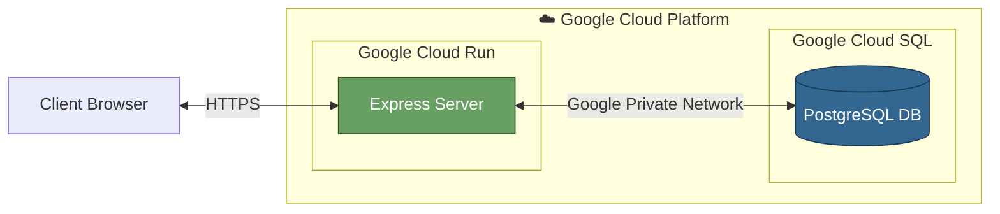
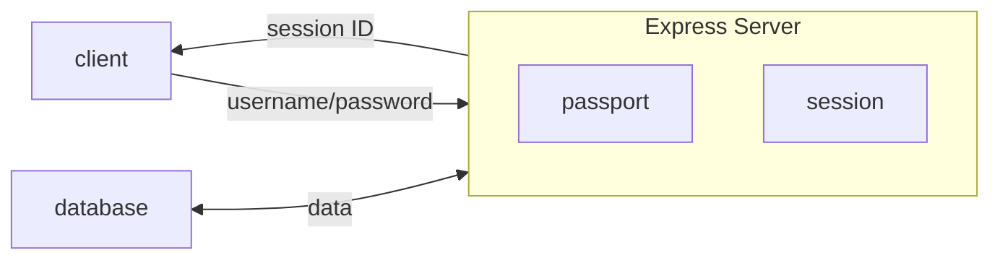
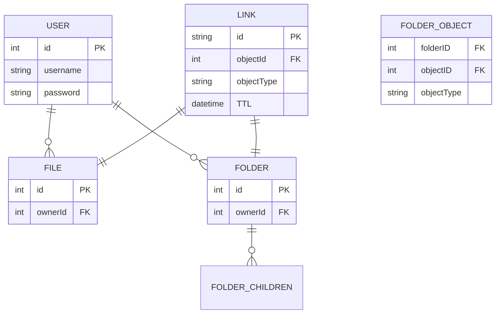

# File Uploader

A google drive like application where users can upload and share files.

## Features

Clickable folder structure
Sharable links that can either link to the file or folder

- Shares the entire folder for the entire TTL

## Build Plan

logo
navbar
storage usage status

## Architecture

The pattern for this system is MVC and we're hosting our application and database on Google Cloud Platform. The server is sitting on a container in Cloud Run and the database on Cloud SQL.

### Architecture Design

### System Design

### Database Design

## Installation

## Attributions

CSS reset from [Josh Comeau](https://www.joshwcomeau.com/css/custom-css-reset/)

### Icons and Assets

[Pdf icons created by Dimitry Miroliubov - Flaticon](https://www.flaticon.com/free-icons/pdf)

[Logos icons created by pocike - Flaticon](https://www.flaticon.com/free-icons/logos)

[Microsoft access file icons created by Pixel perfect - Flaticon](https://www.flaticon.com/free-icons/microsoft-access-file)

[Mp3 icons created by Shahryar MInhas - Flaticon](https://www.flaticon.com/free-icons/mp3)

Icons from google fonts
